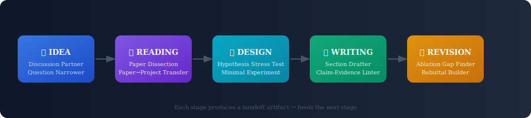

# Vibe Research

> **A prompt composition system for ML/AI researchers** — not a template dump, but a skill you build.




---

## Why this exists

**Templates age. Skills compound.**

As models improve, the optimal prompt for any task keeps shifting. A prompt that worked well six months ago may now be suboptimal — and no static template collection can keep up.

What *does* transfer: the skill of composing a context-aware prompt from first principles. A prompt built around your exact hypothesis, your baselines, and your constraints will always outperform a generic one.

This repo gives you both: ready-to-use prompts for immediate needs, and a composition method for everything else.

> *"You could write these prompts yourself in 5 minutes."*
> — fair criticism of most prompt repos

The difference here: each prompt ships with an **output contract**, **failure modes**, and **iteration paths**. The value isn't the prompt text — it's knowing exactly when it breaks and how to fix it.

---

## Quick Start (30 seconds)

Pick your current research stage:

| I'm trying to… | Use this |
|---|---|
| Clarify a vague research idea | [Idea Discussion Partner](prompts/idea/idea-discussion-partner.md) |
| Narrow a scope that's too broad | [Research Question Narrower](prompts/idea/research-question-narrower.md) |
| Extract what a paper means *for my project* | [Paper Dissection](prompts/reading/paper-dissection.md) |
| Turn a paper finding into concrete actions | [Paper-to-Project Transfer](prompts/reading/paper-to-project-transfer.md) |
| De-risk my hypothesis before running experiments | [Hypothesis Stress Test](prompts/design/hypothesis-stress-test.md) |
| Design the smallest meaningful experiment | [Minimal Decisive Experiment](prompts/design/minimal-decisive-experiment.md) |
| Turn messy notes into a section draft | [Section Drafter from Notes](prompts/writing/section-drafter-from-notes.md) |
| Check which claims lack evidence | [Claim-Evidence Linter](prompts/writing/claim-evidence-linter.md) |
| Find the ablation a reviewer will demand | [Ablation Gap Finder](prompts/revision/ablation-gap-finder.md) |
| Write a rebuttal that doesn't escalate | [Rebuttal Strategy Builder](prompts/revision/rebuttal-strategy-builder.md) |

---

## Setup: Use as a Claude Project

The fastest way to use this toolkit is to load it into a Claude Project.
Once configured, you invoke prompts by name in natural language — no copy-pasting required.

### Step 1: Create a Claude Project

Open [claude.ai](https://claude.ai), click **Projects** → **New Project**.
Name it something like `Research Toolkit`.

### Step 2: Add files to Project Knowledge

Upload the following files to the project's Knowledge base:

**Core method (required):**
- `docs/how-to-vibe.md`

**Prompts — add the stages you use most:**
- `prompts/idea/idea-discussion-partner.md`
- `prompts/idea/research-question-narrower.md`
- `prompts/reading/paper-dissection.md`
- `prompts/reading/paper-to-project-transfer.md`
- `prompts/design/hypothesis-stress-test.md`
- `prompts/design/minimal-decisive-experiment.md`
- `prompts/writing/section-drafter-from-notes.md`
- `prompts/writing/claim-evidence-linter.md`
- `prompts/revision/ablation-gap-finder.md`
- `prompts/revision/rebuttal-strategy-builder.md`

> If unsure, upload all of them. Each file is self-contained and small.

### Step 3: Set a Project System Prompt (optional but recommended)

In the Project's **Custom instructions** field, paste:

```
You have access to a structured research prompt toolkit.
When the user names a prompt (e.g. "Hypothesis Stress Test"), locate it in your knowledge,
fill in the placeholders with the information the user provides, and produce output
that strictly follows that prompt's output contract.
If the user does not provide enough information to fill a placeholder, ask for it before proceeding.
Do not summarize or paraphrase the prompt structure — execute it.
```

### Step 4: Use it

You no longer need to copy-paste prompt templates. Just describe what you need:

```
Run a Hypothesis Stress Test.
Hypothesis: sparse attention reduces memory without hurting downstream NER performance.
Mechanism: local windows capture most entity-relevant context.
Known counterexamples: Longformer ablations show degradation on nested entities.
```

Claude will locate the prompt, fill the placeholders, and return output in the correct format.

To chain stages, carry the output forward explicitly:

```
The disconfirming check from the stress test was: [paste output].
Now run a Minimal Decisive Experiment with resource limit: 1 GPU day.
```

### What this gives you

| Without Project setup | With Project setup |
|---|---|
| Copy-paste prompt template each time | Invoke by name in plain language |
| Manually track which stage you're in | Claude follows the handoff chain |
| Re-read failure modes when output is bad | Ask Claude to iterate using the failure modes |

---

## A Real Example

**Situation:** You have a rough hypothesis — *"contrastive pretraining on domain-specific corpora improves few-shot transfer to low-resource biomedical NER."*

**What most people do:** paste this into ChatGPT and ask "is this a good idea?" and get back a generic 500-word response that doesn't help you decide anything.

**What this toolkit does:**

**Step 1 — Idea Discussion Partner**

```
Research context: NLP, few-shot NER on biomedical data, limited labeled data
Initial idea: contrastive pretraining on PubMed improves few-shot transfer
Target venue: ACL / EMNLP
Main uncertainty: whether contrastive signal generalizes across NER label schemas
Max questions per turn: 3
```

Output: core tension identified (*contrastive objectives optimize token similarity, not label boundaries*), 3 high-leverage questions, one minimal falsification test.

**Step 2 — Hypothesis Stress Test** (before writing a single line of code)

```
Hypothesis: domain contrastive pretraining improves few-shot NER transfer
Mechanism: shared entity surface forms create better token representations
Known counterexamples: BioBERT ablations show marginal gains on BC5CDR
```

Output: weakest link identified (*label schema mismatch is untested*), cheap 50-example diagnostic to catch it in 2 hours instead of 3 weeks.

**Result:** The diagnostic failed. The hypothesis needed revision before any serious compute was spent.

This is the workflow. Not "prompt → answer." **Prompt → decision.**

---

## The Composition Method

When no existing prompt fits, use [how-to-vibe.md](docs/how-to-vibe.md) to compose one in under 5 minutes.

Five steps:

1. **Pin the research stage** — controls intent and output contract
2. **Define task boundary** — if it can't fit in one sentence, scope is too broad
3. **Define quality target** — criteria must be observable in the output
4. **Define hard constraints** — protects against hallucination and scope drift
5. **Define workflow handoff** — every prompt produces an artifact for the next stage

```
Role: {{role}}
Task: {{task_goal}}
Input Scope: {{input_scope}}
Quality Criteria: {{quality_criteria}}
Hard Constraints: {{hard_constraints}}
Output Contract: {{output_contract}}
Handoff Artifact: {{handoff_artifact}}
```

Fast fixes when output degrades:
- Generic output → tighten `{{input_scope}}` and `{{quality_criteria}}`
- Unstable output → strengthen `{{output_contract}}`, add examples
- Factual drift → add stricter `{{hard_constraints}}`
- Too verbose → lower `{{output_depth}}`

---

## Design Decisions

**Why stage-based?** The right output contract for *idea generation* is completely different from *revision*. Stage-aware prompts avoid the "help me with my research" failure mode that produces generic, non-actionable responses.

**Why output contracts and failure modes?** A prompt without a failure mode is a prompt you can't improve. Every prompt here documents exactly how it breaks — so iteration is structured, not trial-and-error.

**Why a composition method?** Prompt templates have a shelf life of 6–12 months as model capabilities shift. The composition skill transfers indefinitely. This repo will stay useful as models improve and what "a good prompt" means keeps changing.

---

## Repository Structure

```
prompts/
  catalog.md              # stage index — start here
  idea/
  reading/
  design/
  writing/
  revision/

docs/
  how-to-vibe.md          # composition method for cases not covered
  vibe-placeholder-skills.md
  vibeable-research-map.md
```

---

## Contributing

A prompt contribution must include:

1. Placeholder set used
2. Output contract (what exactly the prompt produces)
3. Failure modes and iteration paths
4. One reproducible example with real (not dummy) inputs

Without failure modes, the contribution will not be merged.

---

## Acknowledgements

Inspired by open prompt-sharing efforts in the research community, especially [awesome-ai-research-writing](https://github.com/Leey21/awesome-ai-research-writing).


---

## License

MIT
